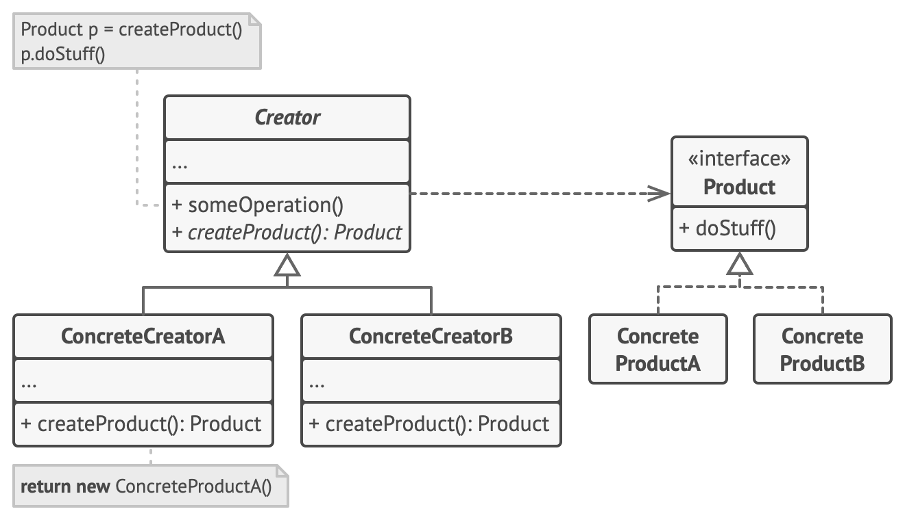
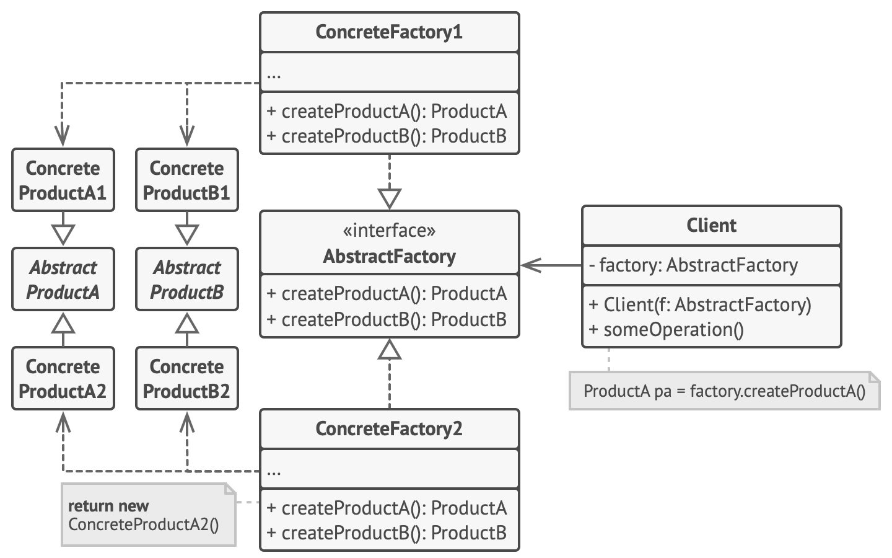

# 创造型模式

## 工厂方法模式

Product为单一产品，例如都是椅子，实现为长椅和躺椅

## 抽象工厂模式

Product为相关产品，例如椅子和桌子，实现为长椅和躺椅，长桌和圆桌

ProductA1 ProductB1 属于相关产品的相同风格，例如古典椅子和古典桌子
ProductA2 ProductB1 属于相关产品的不同风格，例如现代椅子和古典桌子

## 建造者模式

## 原型模式

## 单例模式

## 对比

|维度|工厂方法|抽象工厂|
|---|---|---|
|设计目标|创建单一产品|创建一组**相关**产品|
|创建范围|一个工厂类创建一个产品|一个工厂类创建多个相关产品|
|结构|单一层次结构|多维层次结构|
|扩展性|易扩展新产品类型|易扩展新产品族，难扩展新产品等级|
|适用场景|单一产品创建|相关产品族创建|
